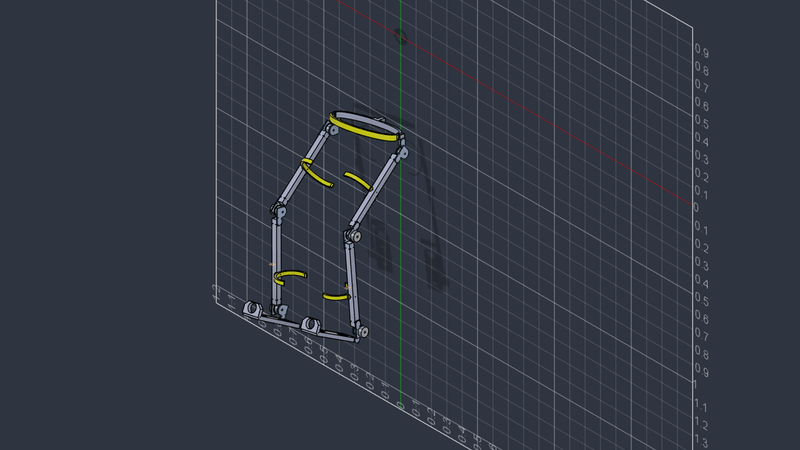

# Orthotic Exoskeleton

Design and analysis workspace for **ExoEskeleto**, a lower-limb orthotic exoskeleton. This repository brings together CAD models, manufacturing drawings, gait animations, Euler–Lagrange torque analysis, component spreadsheets, and research documents.

The current actuator-sizing study uses a **passive hip with powered knee and ankle joints**, following the updated manufacturing drawing. Research documents also explore vision-language-action (VLA) assistance and fall-risk modelling.



## Start here

- [Updated manufacturing drawing](ExoEskeleto_Manufacturing_Drawing%20%281%29.pdf) — hardware geometry and actuator layout.
- [Torque analysis, version 2](Motor_Torque_Analysis_ExoEskeleto_v2.md) — model, assumptions, load cases, and actuator-sizing rationale.
- [Torque analysis PDF](output/pdf/Motor_Torque_Analysis_ExoEskeleto_v2.pdf) — shareable report.
- [Bill of materials](Low_Cost_Exoskeleton_VLA_BOM_VALIDATED.xlsx) and [shopping list with screenshots](Exoskeleton_Shopping_List_with_Screenshots.xlsx) — component planning.

## Repository guide

| File or folder | Contents |
| --- | --- |
| [ExoEskeleto_final.step](ExoEskeleto_final.step) | Neutral-format assembly geometry |
| [Exoskeleton.stp.SLDPRT](Exoskeleton.stp.SLDPRT) | SolidWorks part model |
| [MOSAIC_HIP_SOLIDWORKS/](MOSAIC_HIP_SOLIDWORKS/) | Pelvic plate and hip-module part files |
| [Lagrange_Euler_Torque_Power.py](Lagrange_Euler_Torque_Power.py) | Three-link inverse dynamics, torque/power calculations, and sizing outputs |
| [ExoWalk_frames/](ExoWalk_frames/) | Joint-angle JSON data, rendered frames, GIFs, and videos |
| [exo selection animations/](exo%20selection%20animations/) | Selected walking and running animations |
| [output/torque_analysis/](output/torque_analysis/) | Saved CSV and JSON results plus torque and sizing plots |
| [output/pdf/](output/pdf/) | Version 1 and version 2 analysis reports |
| `Motor_Torque_Analysis_ExoEskeleto_v1.*` / `v2.*` | Analysis documents and available source formats |
| [ExoVLA_WM_paper.pdf](ExoVLA_WM_paper.pdf), [aegis.pdf](aegis.pdf) | Research context for assistance and control |

The version 2 report follows the updated manufacturing drawing and supersedes the earlier actuator-sizing assumptions. `ExoEskeleto_final.SLDASM` is currently an empty file; use the STEP geometry and available part files when inspecting the design.

## Run the torque analysis

Use Python 3.10 or newer with NumPy, SciPy, and Matplotlib. Run the commands from the repository root so the default gait-data path resolves correctly.

```bash
git clone https://github.com/ayushdebnath012/orthotic-exoskeleton.git
cd orthotic-exoskeleton
python3 -m pip install numpy scipy matplotlib

# Print model checks, gait results, and actuator ratings.
python3 Lagrange_Euler_Torque_Power.py

# Also generate CSV, JSON, and PNG artifacts.
python3 Lagrange_Euler_Torque_Power.py --write
```

By default, `--write` saves these files to `output/torque_analysis/`, replacing existing results with the same names:

- `euler_lagrange_gait_results.csv`
- `euler_lagrange_summary.json`
- `gait_joint_torque.png`
- `support_motor_sizing.png`

For a separate run with a different user mass:

```bash
python3 Lagrange_Euler_Torque_Power.py \
  --user-mass 70 \
  --write \
  --output-dir output/torque_analysis_70kg
```

Use `python3 Lagrange_Euler_Torque_Power.py --help` to see options for frame mass, moving-link masses, gait input, cycle time, support load, centre-of-pressure offset, and engineering factor. Matplotlib uses a non-interactive backend, so plot generation does not require a display.

## Model and sizing baseline

The analysis represents one leg as three rigid links in the sagittal plane. It evaluates a swing phase using the supplied CAD gait and a bent-knee support/sit-to-stand load case.

| Default parameter | Value |
| --- | --- |
| User mass | 80 kg |
| Frame mass | 6.49 kg |
| Thigh / shank / foot lengths | 0.400 / 0.420 / 0.260 m |
| Gait cycle | 2.4 s |
| Vertical support per leg | 0.60 × combined user and frame weight |
| Centre-of-pressure offset | 0.060 m forward of the ankle |
| Engineering factor | 1.50 |

The version 2 study selects these provisional targets **per side**, at the joint output:

| Joint | Actuation | Continuous torque target | Peak torque target | Reduction ratio |
| --- | --- | ---: | ---: | ---: |
| Hip | Passive | — | — | — |
| Knee | Powered | 60 N·m | 120 N·m | 80:1 |
| Ankle | Powered | 30 N·m | 60 N·m | 60:1 |

The passive hip still carries a reaction moment. These targets are engineering sizing results, not measured actuator performance. See the [full report](Motor_Torque_Analysis_ExoEskeleto_v2.md) for load-case calculations and motor-side torque estimates.

## Status and assumptions

This repository is a design and engineering study. The model uses estimated body-segment properties and an allocated distribution of frame mass. Measured ground-reaction-force histories, exported CAD joint zeros, motor/gearbox masses, rotor inertia, friction, backlash, and efficiency maps are not supplied. The analysis is not a human-use safety certification.

The repository includes existing research and project documents alongside the analysis. No repository-wide license has been specified.
